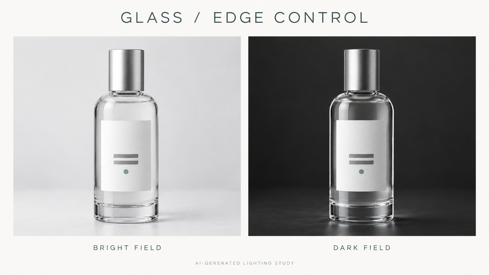

# Visual Craft Recipes

[Korean](README.md) | **English**

**Turn a designer's visual judgment into instructions you can copy, test, and improve.**

A collection of recipes for lighting, reflections, and product motion. Each recipe breaks a visual goal into concrete conditions and explains what to fix first when the result drifts. Documentation is available in Korean and English; all generation prompts are in English.

**v0.3.0 — experimental / recipe comparisons not yet run.** This collection includes recipes, prompts, five AI-generated fictional product references and explanatory images, and experiment templates. The reference images have been generated. Comparisons of baseline and recipe prompts under the same conditions, model-specific performance checks, and actual video generation have not been performed.

AI-generated fictional products and an explanatory lighting illustration. These images are not results from a controlled performance comparison.

## Choose a recipe

| Recipe | Problem | What to compare |
|---|---|---|
| [01 Clear glass](recipes/01_clear_glass.en.md) | The outline disappears into the background or the label changes | A vague request / dark edges against a light background / bright edges against a dark background |
| [02 Metal highlights](recipes/02_metal_highlights.en.md) | Reflections become chaotic or the surface looks like gray plastic | A vague request / a continuous reflection band and consistent material |
| [03 Product motion](recipes/03_product_motion.en.md) | Product rotation, camera movement, and background changes get mixed together | A combined request / fixed camera with partial product rotation / fixed product with camera approach |

## Run your first comparison

1. Read a recipe and its English brief: [glass](examples/01_clear_glass.en.json), [metal](examples/02_metal_highlights.en.json), or [motion](examples/03_product_motion.en.json).
2. Use a product PNG from `assets/` as a shape and material reference. These are fictional AI-generated products, not evidence of a real product's unseen surfaces, dimensions, or physical properties. To use your own product, replace the input with a photo you have permission to use and record the change.
3. Attach the PNG and the relevant text from `prompts/` to a tool that supports image references. Record the tool, model, date, output size, reference strength, and whether seeds are supported. This repository does not require a specific image tag or API format.
4. Compare baseline and recipe prompts using the same input, model, and output size. Use the same seed if supported. Without seeds, try at least three runs per condition and keep every result. Three runs are a suggestion for a small exploratory comparison, not a statistical performance guarantee.
5. Fill in [experiment_record.json](templates/experiment_record.json). Use the recipe checklist to mark each check as pass, fail, or undetermined.

For video, choose the included metal product PNG or another reviewed starting image. Use the same starting image for both motion conditions. If you generate a new image, record that process too. Results with different starting images are not a comparison under the same conditions. Record generated references separately from real product photographs.

## What is shared here?

- **Judgment:** decide which shapes, information, and motion must survive before optimizing appearance.
- **Inputs:** fictional AI-generated product images that do not depend on a client or brand.
- **Execution:** baseline and intent-specific prompts, plus briefs for recording tools and conditions.
- **Review:** checklists for spotting failure and deciding when to edit, composite, or move to 3D.
- **Contribution:** a format for sharing unsuccessful results alongside successful ones.

When a product label must remain exact, do not treat generated lettering as the final source artwork. Decide whether to composite the original label or create the graphics separately.

## Sources and process

Topics were selected from the Visual Craft working knowledge of [bloglluukk-glitch](https://github.com/bloglluukk-glitch). Public documentation and English prompts were written with Codex's help, and reference images were created with the built-in image generation tool. AI-assisted writing does not mean the recipes have been validated through comparisons under the same conditions. See [Sources and claim boundaries](SOURCES.en.md) and [Contributing](CONTRIBUTING.en.md).

## Reuse

The newly written documentation, prompts, templates, and AI-generated reference images are offered under [CC BY 4.0](LICENSE.en.md). You may share, adapt, and use them commercially with appropriate credit, a license link, and an indication of changes. External articles, photographs, and software remain subject to their own terms.

[Asset guide](assets/README.en.md) · [Changelog](CHANGELOG.en.md) · [Complete file manifest](UPLOAD_MANIFEST.json)
