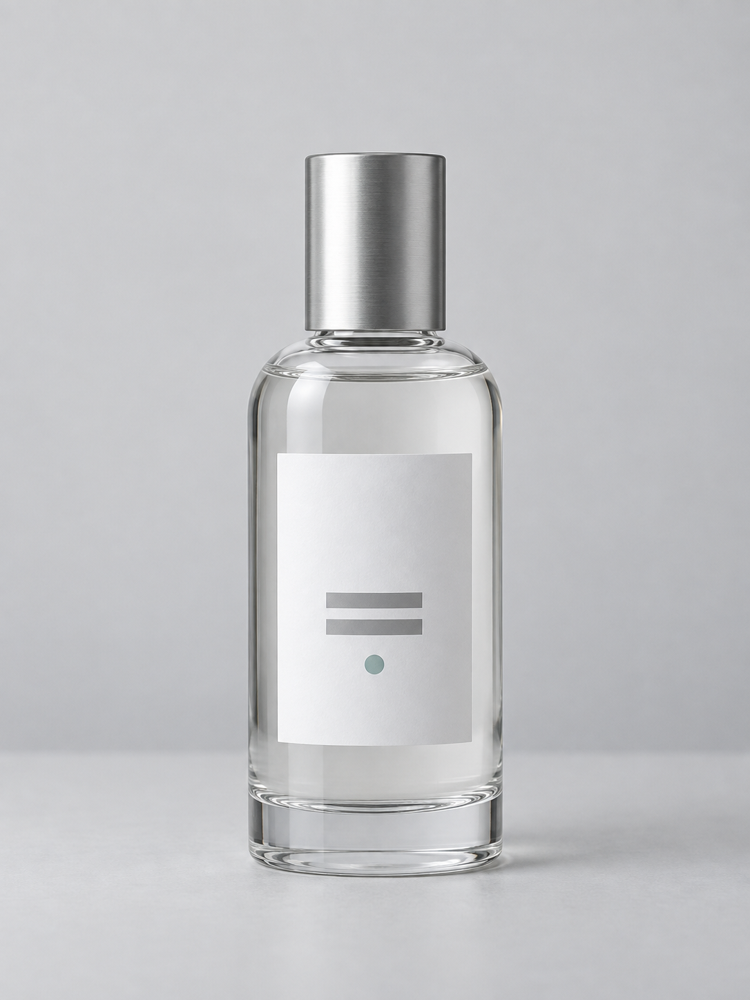

# 01 — 투명 용기의 윤곽과 라벨 보존

**한국어** | [English](01_clear_glass.en.md)

상태: **experimental / 레시피 비교 결과 미검증**. 실패 항목은 점검할 가능성이며 이번 실험의 관측 결과가 아니다.

## 해결할 문제

투명 용기가 배경에 묻히거나, 분위기를 바꾸는 동안 병 비율·캡·라벨이 달라지는 상황을 다룬다. 목표는 제품 식별을 먼저 고정하고 조명만 비교하는 것이다.

## 지킬 것과 바꿀 것

| 지킬 것 | 바꿔볼 것 |
|---|---|
| 병의 실루엣·높이 대비 폭·캡 크기·라벨 위치·정면 구도 | 밝은 배경/어두운 배경, 반사선의 밝기·폭, 배경과 제품의 분리 |
| 라벨에 있는 두 줄과 표식의 개수·배치 | 유리 재질은 유지하고 배경·조명 표현 |



위 그림은 내장 imagegen으로 만든 **가상 유리병 참고 이미지**다. 실제 제품 사진이나 동일 조건 비교 결과는 아니다. 형태·유리 재질·무문자 라벨의 배치부터 보존하는 실험 입력으로 사용한다. 실제 글자 보존은 별도 원본 라벨을 제공하고 1자 단위로 대조하는 추가 실험이다.

## 조명 선택


- **밝은 배경 조건:** 배경과 투명체가 겹치더라도 가장자리를 어둡게 구분하도록 요청한다.
- **어두운 배경 조건:** 길게 이어진 밝은 윤곽으로 용기의 경계를 읽도록 요청한다.
- 둘은 서로 다른 의도다. 한 프롬프트 안에 두 배경을 동시에 넣지 않는다.

유리 촬영에서 확산 배경과 스트립을 따로 다루는 사례는 [S1](../SOURCES.md)을 참고한다. 생성 설명 이미지와 아래 프롬프트는 그 사례를 복제한 설정이 아니라 이 묶음의 비교 설계다. 설명 이미지는 별도의 이미지 생성 요청으로 제작한 일러스트이며 아래 프롬프트 실행 결과가 아니다.

## 실행

1. `examples/01_clear_glass.json`을 확인하고 제품 PNG를 형태·재질 참고 입력으로 붙인다.
2. `prompts/01_glass_baseline.txt`로 baseline을 만든다.
3. 동일 입력·모델·크기에서 `01_glass_bright.txt`와 `01_glass_dark.txt`를 각각 실행한다.
4. 시드가 지원되면 같은 시드를 쓰고, 결과 전체와 설정을 기록한다. 밝은 배경과 어두운 배경은 두 접근의 비교이며 조명 한 변수의 인과 검증은 아니다.
5. 선택한 접근 안에서 윤곽선의 폭 지시만 바꿔 추가 비교한다. 그때 나머지 조건은 유지한다.

## 복사할 프롬프트 — 밝은 배경

```text
Use the attached fictional AI-generated product image as the reference for geometry, proportions, cap, label layout, and glass material. Change only the background and lighting. Show one clear glass bottle in the same front-facing pose. Preserve its silhouette, proportions, cap size, and the position of the plain white label with its two gray bars and small circular mark. Render a neutral studio product image on a softly illuminated light background. Define the glass boundary with restrained dark edge contrast. Keep the central label unobstructed and the cap clearly separated from the bottle. The bottle rests on a matte surface with one coherent contact shadow. Preserve the reference glass material while changing the lighting. Keep the full product inside the frame with comfortable margins. Output a single 3:4 image.
```

## 검수와 수정 순서

| 검사 | 실패 판정 | 다음 수정 |
|---|---|---|
| 형태 | 병이 늘어남, 캡 크기 변화, 라벨 이동 | 조명 실험 중단. 이미지 참고 강도·편집 마스크·입력 방식부터 확인 |
| 윤곽 | 한쪽 경계가 사라지거나 새 병처럼 비대칭 | 선택한 밝은/어두운 접근을 유지하고 경계 대비만 수정 |
| 라벨 | 반사선이 중앙을 가림, 표식 개수 변화 | 중앙 라벨 영역 보존을 다시 명시. 정확성이 필요하면 원본 그래픽 합성 |
| 굴절·접지 | 용기가 이중으로 보임, 바닥이 떠 있음 | 부분 수정으로 해결 가능한지 확인. 형태·광학 정확도가 핵심이면 3D 또는 실촬영으로 이동 |

라벨은 확대해 확인한다. 밝은 선이 많다는 이유만으로 유리 표현을 통과시키지 않는다. 병 경계·캡·중앙 정보가 동시에 읽혀야 한다.

## 실험 기록

baseline/bright/dark의 동일 조건 비교 관측은 아직 없다. 첨부한 제품과 설명 이미지는 별도 제작한 AI 생성 참고 자산이다. baseline/bright/dark의 모든 결과와 통과·실패·판정 불가 항목을 `templates/experiment_record.json`에 기록한다. 새 참고 이미지를 쓰면 자산 출처와 역할도 적는다.
