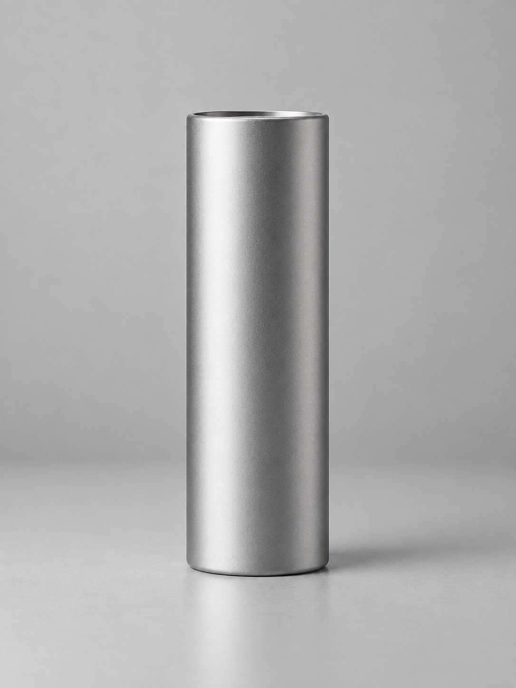
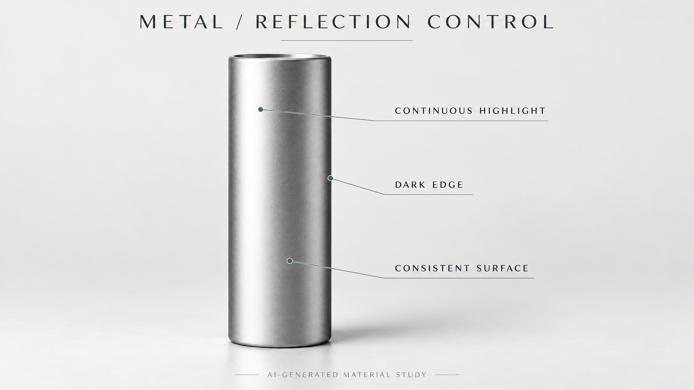

# 02 — 금속 제품의 하이라이트 정리

**한국어** | [English](02_metal_highlights.en.md)

상태: **experimental / 레시피 비교 결과 미검증**. 아래 실패 항목은 예상 점검 대상이다.

## 해결할 문제

‘고급스러운 금속’이라는 요청에서 임의의 반사·스크래치·색 변화가 늘어나거나, 전체가 회색 플라스틱처럼 보이는 상황을 다룬다. 재질 이름에 더해 **반사 띠의 구조**를 설명하고 같은 형태 안에서 비교한다.

## 입력과 보존 기준



내장 imagegen으로 만든 가상 은색 새틴 금속 제품의 참고 이미지다. 실제 제품 사진·금속성 측정·동일 조건 비교 결과는 아니다. 이번 의도는 은색 새틴 금속이며, 형태·높이 대비 폭·상단 경계·바닥 위치를 고정한다. 크롬·도장·브러시드 금속은 이번 비교에서 섞지 않는다.

## 반사를 나누어 보기



설명 그림은 별도 AI 생성 요청으로 제작했다. 먼저 넓고 연결된 밝은 띠와 어두운 경계로 곡률이 읽히는지 확인한다. 아래 프롬프트의 실험 결과와 구분한다. 거칠기와 금속성은 다른 속성이라는 배경은 [S2](../SOURCES.md)를 참고한다. 생성 프롬프트가 물리 셰이더 값을 정확히 구현한다는 뜻은 아니다.

## 실행

1. `examples/02_metal_highlights.json`의 입력·보존 기준을 확인한다.
2. `prompts/02_metal_baseline.txt`와 `02_metal_controlled.txt`를 같은 입력·모델·크기로 비교한다.
3. 큰 차이가 있으면 전체 지시 묶음의 탐색 결과로 기록한다. 어떤 문장 하나가 원인이었다고 단정하지 않는다.
4. controlled 조건 안에서 반사 띠의 폭만 바꿔 두 번째 실험을 한다. 금속 종류·색·카메라는 그대로 둔다.

## 복사할 프롬프트

```text
Use the attached fictional AI-generated product image as the reference for geometry, proportions, rim, and satin silver material. Change only the lighting and reflection structure. Show one unbranded cylindrical product made of silver satin metal. Preserve its silhouette, height-to-width ratio, top rim, and base position. Keep the surface color consistent. Describe the curved body through one broad, continuous vertical reflection that fades gently into a darker side. Keep the highlight below clipping so the surface transition remains visible. Use a quiet neutral background and a matte support surface with a coherent contact shadow. The surface has fine restrained texture, not deep scratches. Reflections should describe the cylinder's curvature rather than introduce new painted stripes or scenery. Keep the whole product in frame. Output a single 3:4 studio product image.
```

## 검수와 수정

| 검사 | 실패 판정 | 다음 수정 |
|---|---|---|
| 형태 | 상단 림·폭·높이가 바뀜 | 참고 입력 방식·보존 영역 먼저 수정 |
| 반사 연결 | 띠가 조각나거나 방향이 서로 충돌 | 반사 지시를 한 띠로 줄이고 장식광·배경 소품 지시 제거 |
| 표면색 | 밝은 띠가 도장 줄무늬나 색 얼룩이 됨 | 일정한 은색 재질과 조명에 의한 밝기 변화를 구분해서 재서술 |
| 금속 판독 | 반사가 거의 없고 회색 덩어리로 보임 | 밝은 면과 어두운 경계를 분리. 금속 종류를 바꾸는 것은 다음 독립 실험으로 |
| 과도한 결 | 스크래치가 제품 손상처럼 보임 | 미세 결 지시를 약하게 하거나 제거하고 기록 |

작은 고정 그림만 보고 실제 금속 종류를 판별했다고 주장하지 않는다. 정확한 제품색·가공 흔적을 보존해야 하면 해당 실물 사진이나 3D 재질을 기준으로 비교한다.

## 후반 작업으로 넘길 조건

반사선 보정만 남고 제품 형태가 안정적이면 리터칭을 검토한다. 형태·정확한 부품·실제 금속 반응이 납품 기준이면 실촬영이나 3D로 전환한다. 프롬프트를 길게 늘리는 것을 유일한 해결책으로 삼지 않는다.

## 실험 기록

baseline/controlled의 동일 조건 비교 실행 결과는 아직 없다. 첨부 이미지는 별도 생성한 참고 자산이다. 결과 전부·설정·형태/반사/재질 검수와 바꾼 변수 하나를 기록한다.
