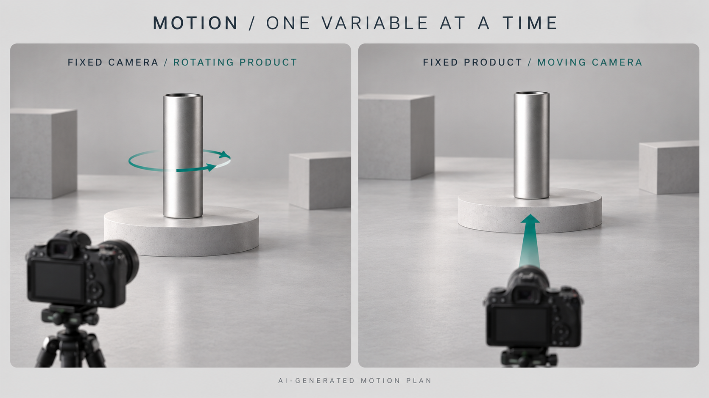

# 03 — 제품 움직임과 카메라 움직임 분리

**한국어** | [English](03_product_motion.en.md)

상태: **experimental / 실제 영상 생성·프레임 검수 미실행**.

## 해결할 문제

제품이 돌고 카메라도 돌며 빛까지 흐르는 요청은 결과의 원인을 구분하기 어렵다. 이번 레시피는 **카메라 고정+제품 부분 회전**과 **제품 고정+카메라 접근**을 나누어 비교한다.



첨부 그림은 내장 imagegen으로 만든 카메라·제품의 움직임 계획 설명이다. 실제 영상의 시작·중간·끝 프레임이 아니다. 왼쪽의 원형 화살표는 부분 회전의 방향이며 360도 회전 지시가 아니다.

## 시작 이미지 준비

1. 기본 입력은 `assets/metal_reference.png`의 AI 생성 가상 제품이다. 02 레시피에서 추가 이미지를 만들었다면 형태가 맞는 결과 하나로 교체할 수 있다. 선택한 이미지의 파일과 설정을 기록한다.
2. 같은 시작 이미지를 두 영상 조건에 모두 사용한다. 원통 바닥 옆에 작은 고정 블록, 뒤쪽에 큰 고정 배경 블록이 있으면 시차 검사가 쉽다. 추가한다면 두 조건 모두 같은 수정된 이미지를 쓴다.
3. 설명용 `motion_plan.png` 전체를 제품 정체성 입력으로 쓰지 않는다. 시작 입력은 제품 PNG이며, 정면 참고 이미지로 보이지 않는 면을 검증할 수는 없다.
4. 모델이 4초를 지원하지 않으면 지원 길이를 골라 두 조건을 맞춘다. 4초는 설계값이며 최적값 주장이 아니다.

카메라 이동을 경로로 다루는 촬영·3D 예는 [S3·S4](../SOURCES.md)를 참고한다. 움직임을 한 가지씩 시험하는 것은 이 묶음의 검수 설계다.

## 조건 A — 카메라 고정, 제품 부분 회전

```text
Use the attached approved image as the exact first-frame reference. Make a four-second continuous product shot. The camera position, framing, focal length, background, and studio lights remain fixed. Only the cylindrical product rotates gently in place by approximately fifteen degrees around its own vertical center axis, then settles. Preserve the product's proportions, top rim, base, and surface identity throughout. The support surface and all background objects remain stationary. Let reflections respond to the product's rotation rather than adding moving lights. End with a brief stable hold. This is a partial reveal, not a full 360-degree spin. Use a silent shot when the tool supports audio controls.
```

숨은 면의 정확한 재현을 확인할 참고가 없으므로 전면 중심의 작은 회전부터 시험한다. 15도는 비교 설계값이며 보존을 보장하는 경계가 아니다.

## 조건 B — 제품 고정, 카메라 접근

```text
Use the same approved image as the exact first-frame reference. Make a four-second continuous product shot. The cylindrical product, support surface, background objects, and studio lights remain stationary. Only the camera moves gently forward toward the product along a straight path, without orbiting or tilting. Keep the focal length constant. Maintain focus on the product and preserve its proportions, top rim, base, and surface identity. The product becomes slightly larger in frame, while near and far objects show coherent perspective change. End with a brief stable hold. Use a silent shot when the tool supports audio controls.
```

카메라 이동을 요청했더라도 모델은 단순 확대를 출력할 수 있다. 서로 다른 깊이의 단서가 없으면 실제 이동과 확대를 구분할 근거가 부족하므로 판정을 보류한다.

## 비교 순서

`prompts/03_motion_baseline.txt`는 복합 요청의 baseline이다. baseline과 A/B는 여러 지시가 달라지는 탐색 비교다. A가 B보다 좋다는 보편 순위를 매기지 않는다. 먼저 각각 의도대로 움직였는지 검사한 뒤, 같은 조건 안에서 회전량 또는 이동량 하나만 바꾸어 본다.

## 전체 영상 검수

| 검사 | A의 기대 | B의 기대 |
|---|---|---|
| 배경 | 프레임 안 위치가 고정 | 고정된 공간이 카메라 접근에 따라 투영 변화 |
| 제품 | 중심축이 유지되며 부분 회전 | 제자리 고정, 회전 없음 |
| 형태 | 모든 프레임에서 림·베이스·비율 유지 | 모든 프레임에서 림·베이스·비율 유지 |
| 반사 | 고정된 광원 아래 회전에 따른 변화 | 카메라 시점 변화에 따른 변화 가능 |
| 마지막 | 회전이 끝나고 안정 | 접근이 끝나고 안정 |

처음·중간·끝을 확인하고 전체를 연속 재생한다. 대표 프레임만 맞아도 중간에 제품이 녹거나 배경이 흔들리면 실패다. 실험 기록에는 프레임 샘플과 전체 재생 여부를 모두 남긴다.

## 실패 후 선택

- 제품이 돌면서 배경도 같이 흐르면 카메라 고정 조건부터 다시 확인한다.
- 제품이 늘어나거나 새 부품이 생기면 움직임을 줄이기 전에 시작 이미지와 보존 기준을 확인한다.
- 카메라 접근이 단순 확대라면 그 결과는 zoom-like로 기록한다. 배경 깊이 단서를 추가하거나 실제 카메라 경로를 가진 3D로 검증한다.
- 정확한 회전·시차가 필요하면 3D 또는 실촬영을 사용한다. 2D 스케일 애니메이션으로 대체하면 디지털 확대라고 표시한다.

## 실험 기록

현재 세 조건 모두 실행 전이다. 모델·길이·시드·시작 이미지·모션 강도·오디오 설정을 기록하고 결과를 붙인다. 입력 조건이 다른 영상끼리는 같은 재현 실험으로 집계하지 않는다.
